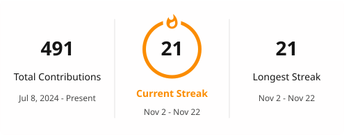

## Hi, I'm Kevin

I'm a Computer Science student at NYU with a minor in Mathematics, graduating in May 2028.
This fall I'm studying abroad at NYU Shanghai. I build full-stack web apps and work on projects in natural language processing, mostly
around how to evaluate machine translation and LLM output. I'm currently looking for summer 2027 software engineering internships.

---

### Projects

**[NYC 15-Minute City Explorer](https://github.com/Shen-42/nyc-15min-info)** · [live](https://www.nyc15min.com/)
An interactive map of New York City that shows what you can reach within 15 minutes of
any address. React and Leaflet front end, FastAPI back end, deployed on Render.

**[Machine Translation Metrics by Phenomenon](https://github.com/mrassell/machine-translation-project)**
Team project on how MT evaluation metrics perform across specific linguistic phenomena.

**[Bridge Translator](https://github.com/Shen-42/bridge-translator)**
A Python program that turns Bridge game shorthand into plain English that beginners can follow.

**[Toronto Winters](https://github.com/Shen-42/toronto-winters)** · [live](https://shen-42.github.io/toronto-winters/)
Charts daily snow on the ground in Toronto, 2006–2025, from Environment Canada station data. 

**[Gallbladder Tracker](https://github.com/Shen-42/gallbladder-tracker)** · [demo](https://shen-42.github.io/gallbladder-tracker/)
A web app for people with gallbladder problems to log meals, their fat content, and pain episodes, so they can see which meals came before the pain.

---

### Tech

---

### GitHub Activity

  <picture>
    <source media="(prefers-color-scheme: dark)" srcset="./profile/stats-dark.svg">
    
  </picture>
  <picture>
    <source media="(prefers-color-scheme: dark)" srcset="./profile/top-langs-dark.svg">
    
  </picture>

<picture>
  <source media="(prefers-color-scheme: dark)" srcset="./profile/streak-dark.svg">
  
</picture>
